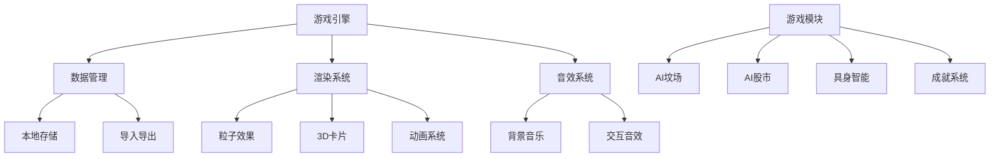

# 🤖 AI轮回模拟器

[](https://github.com/qidouhai/ai-graveyard/stargazers)
[](https://github.com/qidouhai/ai-graveyard/network)
[](https://github.com/qidouhai/ai-graveyard/issues)
[](https://github.com/qidouhai/ai-graveyard/blob/main/LICENSE)


> **预测、埋葬、做空AI泡沫的讽刺游戏** - 一个完整的H5游戏体验

## 🎮 在线试玩

[](https://qidouhai.github.io/ai-graveyard/)

## 🌟 特色功能

### 🏆 完整游戏系统
| 模块 | 功能 | 图标 |
|------|------|------|
| **AI坟场** | 查看和埋葬死亡的AI项目 | 🪦 |
| **重症监护** | 观察挣扎中的AI项目 | 🏥 |
| **孵化器** | 投资新生的AI项目 | 🌱 |
| **具身智能** | 训练机器人AI | 🤖 |
| **AI股市** | 投资、做空AI股票 | 📈 |
| **人类文明** | 查看AI对社会影响 | 🌍 |
| **大空头** | 做空AI泡沫 | 📉 |
| **分享系统** | 生成AI死亡报告 | 📤 |

### 🎯 特色系统
- **🏆 成就系统**：20个讽刺性成就，解锁特殊奖励
- **🧧 春节特供**：红包雨、灯笼装饰、春节版AI
- **🔊 音效系统**：背景音乐和交互音效
- **✨ 视觉效果**：粒子背景、3D卡片、烟花特效
- **💾 数据管理**：自动保存、导入导出功能
- **⌨️ 快捷键**：快速操作，提升游戏体验
- **📱 响应式**：完美适配手机和电脑

## 🚀 快速开始

### 方法一：GitHub Pages（推荐）
1. 访问 [qidouhai.github.io/ai-graveyard](https://qidouhai.github.io/ai-graveyard)
2. 按 `Alt+H` 查看帮助开始游戏
3. 点击左下角快捷按钮探索功能

### 方法二：本地运行
```bash
# 克隆仓库
git clone https://github.com/qidouhai/ai-graveyard.git

# 进入目录
cd ai-graveyard

# 用浏览器打开
open index.html  # Mac
# 或
start index.html # Windows
# 或直接在浏览器中打开 index.html
```

### 方法三：直接下载
1. 下载 [index.html](https://raw.githubusercontent.com/qidouhai/ai-graveyard/main/index.html)
2. 用 Chrome/Firefox/Edge 打开
3. 开始游戏！

## 🎮 游戏指南

### 游戏目标
- **预测准确**：预测AI项目的死亡时间和原因
- **投资获利**：在AI股市中低买高卖
- **完成挑战**：解锁所有成就和挑战
- **成为冥灯**：预测准确率达到80%以上
- **分享体验**：生成有趣的AI死亡报告

### 基本操作
| 操作 | 方法 |
|------|------|
| **生成AI** | 点击"生成新AI"按钮 |
| **查看详情** | 点击AI墓碑 |
| **预测死亡** | 点击"预测"按钮 |
| **投资股票** | 在股市页面操作 |
| **训练机器人** | 在具身智能页面 |
| **查看成就** | 点击左下角奖杯图标 |
| **保存游戏** | 按 `Alt+S` |

### 键盘快捷键
| 快捷键 | 功能 |
|--------|------|
| `Alt + S` | 保存游戏 |
| `Alt + L` | 加载游戏 |
| `Alt + R` | 重置游戏 |
| `Alt + H` | 显示帮助 |
| `Alt + N` | 生成新AI |

## 📱 设备兼容性

- ✅ **桌面浏览器**：Chrome, Firefox, Edge, Safari
- ✅ **移动设备**：iOS Safari, Android Chrome
- ✅ **平板电脑**：iPad, Android 平板
- ✅ **触摸屏**：完整触控支持
- ✅ **键盘**：完整快捷键支持

## 🛠️ 技术架构



### 核心技术
- **前端**：纯 HTML5 + CSS3 + JavaScript
- **图形**：Canvas 粒子系统 + CSS 3D变换
- **存储**：LocalStorage 数据持久化
- **分享**：html2canvas 图片生成
- **音效**：Web Audio API
- **PWA**：渐进式Web应用特性

## 📊 游戏数据

游戏会自动收集**匿名数据**用于改进：
- 游戏时长和进度统计
- 最受欢迎的AI类型
- 玩家行为模式分析
- 设备信息（用于优化）

所有数据仅存储在用户本地，不会上传到任何服务器。

## 🎨 主题定制

游戏支持多种主题：
- **默认主题**：霓虹赛博风格
- **春节主题**：红色金色装饰（自动启用）
- **自定义**：可通过CSS变量调整

```css
:root {
    --neon-cyan: #00ffff;    /* 主色调 */
    --neon-pink: #ff00ff;    /* 辅助色 */
    --neon-green: #00ff00;   /* 成功色 */
    --neon-red: #ff5555;     /* 警告色 */
    --bg-dark: #0a0a1a;      /* 背景色 */
}
```

## 🤝 贡献指南

欢迎提交 Issue 和 Pull Request！

### 开发流程
1. Fork 项目
2. 创建功能分支
3. 提交更改
4. 推送到分支
5. 创建 Pull Request

### 开发要求
- 代码符合 ES6+ 标准
- 添加适当的注释
- 更新相关文档
- 测试所有功能

### 添加新的AI项目
```javascript
const newAI = {
    id: Date.now(),
    name: "项目名称",
    status: "alive",
    daysAlive: Math.floor(Math.random() * 365) + 1,
    cause: "死亡原因",
    epitaph: "墓志铭",
    tags: ["分类标签"],
    hype: 7, // 1-10
    funding: "$10M",
    deathProbability: 0.3
};
```

## 📄 许可证

本项目采用 MIT 许可证 - 查看 [LICENSE](LICENSE) 文件了解详情。

## 🙏 致谢

- **Font Awesome**：图标库
- **Google Fonts**：字体服务
- **html2canvas**：分享图生成
- **所有AI项目**：灵感来源
- **测试玩家**：反馈和改进建议

## 📞 联系与支持

- 📧 **问题反馈**：[GitHub Issues](https://github.com/qidouhai/ai-graveyard/issues)
- 💬 **功能建议**：[GitHub Discussions](https://github.com/qidouhai/ai-graveyard/discussions)
- 🐦 **社交媒体**：欢迎在社交媒体分享游戏体验

## 🌟 Star History

[](https://star-history.com/#qidouhai/ai-graveyard&Date)

---

## 🚀 快速部署

### Vercel 部署
[](https://vercel.com/new/clone?repository-url=https://github.com/qidouhai/ai-graveyard)

### Netlify 部署
[](https://app.netlify.com/start/deploy?repository=https://github.com/qidouhai/ai-graveyard)

### Render 部署
[](https://render.com/deploy?repo=https://github.com/qidouhai/ai-graveyard)

---

<div align="center">

## 🎯 开始你的AI泡沫之旅！

[](https://qidouhai.github.io/ai-graveyard/)

**预测未来，埋葬泡沫，成为行业冥灯！**

</div>

---

## 📁 项目结构

```
ai-graveyard/
├── index.html              # 主游戏文件
├── README.md               # 项目说明
├── LICENSE                 # 开源协议
└── 可选文件夹/
    ├── assets/            # 资源文件夹
    ├── screenshots/       # 游戏截图
    └── icons/            # 应用图标
```

## 🔧 环境要求

- **浏览器**：支持ES6+的现代浏览器
- **网络**：可选（支持离线运行）
- **存储**：需要LocalStorage支持
- **内存**：建议2GB以上
- **分辨率**：建议1280x720以上

## 🎮 游戏截图

<div align="center">
  <table>
    <tr>
      <td></td>
      <td></td>
    </tr>
    <tr>
      <td></td>
      <td></td>
    </tr>
  </table>
</div>

## 📈 更新日志

### v2.0（春节特供版）🎉
- 🎨 新增春节主题装饰
- 🧧 添加红包雨功能
- 🏆 完整成就系统（20个成就）
- 🤖 具身智能训练系统
- 🌍 人类文明影响模块
- 📉 大空头做空系统
- 📤 分享图生成器
- 🔧 完整设置系统

### v1.0（初始版本）
- 🪦 AI坟场基础功能
- 📈 股市交易系统
- 💾 自动保存功能
- 📱 响应式设计
- 🔊 基础音效系统

---

## 🌐 分享游戏

让更多人体验AI泡沫的狂欢与葬礼！

```markdown
🎮 推荐一个超有趣的AI游戏！
《AI轮回模拟器》- 预测、埋葬、做空AI泡沫

🔗 https://qidouhai.github.io/ai-graveyard

#AIGame #HTML5Game #AI泡沫 #春节游戏 #WebGame
```

**在微信/朋友圈分享：**
```
🤖 推荐一个超有趣的AI游戏！
《AI轮回模拟器》春节特供版

这里没有AI的辉煌，只有：
- 死亡的AI项目墓碑
- 挣扎的AI重症监护
- 疯狂的AI股市泡沫
- 具身智能的尴尬笑话

春节特别功能：
🧧 红包雨掉落游戏
🏆 20个讽刺成就
📤 生成AI死亡报告

来体验一下"行业冥灯"的快乐！
🔗 https://qidouhai.github.io/ai-graveyard
```

---

<div align="center">

## ⭐ 如果喜欢这个项目，请给我们一个 Star！

[](https://github.com/qidouhai/ai-graveyard/stargazers)

**你的支持是我们更新的最大动力！** 🚀

</div>

---

## 🔍 搜索引擎优化

- **关键词**：AI游戏, HTML5游戏, 赛博朋克游戏, 春节游戏, 科技讽刺游戏
- **描述**：一个讽刺AI泡沫的HTML5游戏，预测、埋葬、做空AI项目
- **标签**：ai, game, html5, javascript, 春节, 游戏, 赛博朋克

## 📚 相关资源

- [GitHub Pages 部署指南](https://pages.github.com/)
- [HTML5 Game Development](https://developer.mozilla.org/en-US/docs/Games)
- [PWA 渐进式Web应用](https://web.dev/progressive-web-apps/)

## 🐛 常见问题

**Q: 游戏无法保存进度？**  
A: 请确保浏览器启用了LocalStorage，按`Alt+S`手动保存。

**Q: 移动设备上无法正常显示？**  
A: 游戏已适配移动端，请确保使用现代浏览器。

**Q: 如何分享我的游戏数据？**  
A: 在设置页面可以导出游戏数据。

**Q: 游戏卡顿怎么办？**  
A: 在设置中可以降低粒子密度和关闭特效。

---

<div align="center">

### 🎉 感谢体验 AI轮回模拟器！

**项目作者**：qidouhai  
**最后更新**：2026年1月  
**版本**：v2.0 春节特供版

[](https://github.com/qidouhai)
[](https://qidouhai.github.io/ai-graveyard)

</div>
